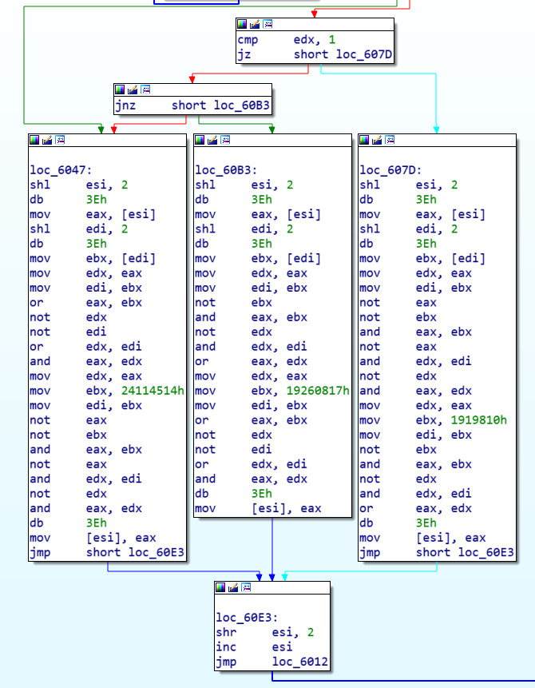

# wp中的图片是软连接图片，git clone 这个仓库到本地后即可正常查看
> 原文在微信公众号“白帽100攻防实验室”与WMCTF官方WriteUP一同发布

## 题目描述

bochs是一个x86cpu模拟器，我写了一个mbr引导程序让cpu从磁盘中读取并执行代码

关键词：MBR，磁盘读取，键盘驱动，CPU从实模式到保护模式，内存分段，地址回绕，古典密码

拿到压缩包以后，得丢到linux平台下才能解压，否则7z会报错。因为其中有一个隐藏文件夹，在windows会出错。

解压完毕后，首先我们打开bochsrc.txt。bochsrc.txt是bochs的默认配置清单。从中可以看到有一个隐藏文件夹./.src，其中有很多配置文件，以及虚拟磁盘文件

提取出虚拟磁盘文件./.src/disk ，bochs读取并执行的代码都在其中


计算机启动的时候，先通过MBR引导，再启动操作系统。MBR位于磁盘的第0块，可以用ida（16bits模式）直接打开disk，查看MBR的内容

注意到图片中红框的位置,MBR从磁盘的第2\6\10个块读取了一些数据到内存中，**基址分别是0x00000900,0x00006000,0x00005700**


接着我们就可以看一看磁盘的第2、6、10块分别是些什么东西了。


建议使用winhex或者010之类的工具把从0x400,0xc00和0x1400开始的三段内容先完整的copy出来单独为一个文件进行分析。

MBR运行结束之后，CPU跳转到了内存的0x900处继续执行代码

### 磁盘偏移0x400处的代码：让CPU从实模式进入保护模式

从0x400开始的这段代码做了三件事情：

1. 通过键盘驱动获取用户输入，并且存入7E3:265这个位置
  这里有一个技术点要注意一下。**CPU读取的键盘输入读取的是通码**，**不是ASCII码**。这里我是用的是第一套通码，并且只识别了部分数据。需要各位细细揣摩这个粗糙的键盘驱动到底向7E3:265这个位置写入了什么，大小写是如何区分的……
  
  
2. 进入保护模式

   这一段代码就不多说了，进入保护模式必须做的：

   打开A20Gate，加载段表数组到gdt寄存器中，设置cr0从右往左第二个bit为1

   进入保护模式后，后面的代码（从图中jmp large far ptr处开始）都是32位的汇编代码，这是一个难点。这个时候我们就得用ida使用32位模式对后面的代码进行分析

   
   
3. 后面这些32位的代码的工作就比较简单了，**首先是设置各段寄存器的段选择子**，然后进行加密，**列换位密码+对读取到的扫描码的每一个字节都加上0x55**，这里就不细讲了。完成这个工作之后，跳转到了内存中0x6000处

### 细节：ds，es中储存的到底是啥，保护模式如何寻址?

[保护模式笔记](https://github.com/Gstalker/Kernel-Learning/tree/master/Cpt4.Rudiment%20of%20Protect%20Mode)

见README：《GDT与段选择子》

保护模式下，寻址通过段寄存器中的段选择子，GDT段表中的分段信息进行寻址。如果这一块没摸透，最后这个加密和验证机制可能就很难搞懂

### 磁盘偏移0xc00：“简单的异或运算”

这一段东西用ida32位可以反编译了。不过不建议看伪码

> 不知道有多少人看到这一步之后被劝退了


看汇编，算法十分简单。做的都是异或运算。这里用python伪码简单描述一下图中6047，60B3，607d这三条代码块的计算方式。

```python
def xor1(a,b):
    return (a|b)&(~a|~b)
def xor2(a,b):
    return ~(~a&~b)&~(a&b)
def xor3(a,b):
    return (a&~b)|(~a&b)
```

```c++
switch(i){
  case 0:
    group[i] = xor2(xor1(group[i],group[(i+1)%9]),0x24114514);
    break;
  case 1:
    group[i] = xor3(xor2(group[i],group[(i+1)%9]),0x1919810);
    break;
  case 2:
    group[i] = xor1(xor3(group[i],group[(i+1)%9]),0x19260817)
    break;
}
```



计算完之后，就进行了校验。\[ecx-0x12354CD\]这个位置可以通过之前提到的段选择子计算出来，位于0x00005700。MBR读取了磁盘中0x1400处的数据，即加密后的flag，并将其存放在这里。


那么整个程序的加密流程就比较清晰了，我们可以着手搞一搞exp

## exp

```python
enc_flag = [0xec5574d8,0x421a04b5,0x2ba6d11,0x8105055f,0xeda06c28,0x6ae00499,0x18a955e7,0x71d63591,0x4537a864]
for n in range(128,-1,-1):               #129轮逻辑运算
    for i in range(8,-1,-1):
        if (n%3 == 0):
            enc_flag[i] = enc_flag[i]^enc_flag[(i+1)%9]^0x24114514
        elif(n%3 == 1):
            enc_flag[i] = enc_flag[i]^enc_flag[(i+1)%9]^0x1919810
        elif(n%3 == 2):
            enc_flag[i] = enc_flag[i]^enc_flag[(i+1)%9]^0x19260817

group = [None] * (len(enc_flag) * 4)
for i in range(9):
    for n in range(4):
        group[i*4+n] = (enc_flag[i]>>(8*n))&0xff

for i in range(len(group)):#凯撒解密
    group[i] = (group[i] - 0x55)%0x100


flag = [None] * len(group)
for i in range(6):#行列密码解密
    for n in range(6):
        flag[i*6+n] = group[n*6+i]

key_board_mapping = {
    0x2:'1',
    0x3:'2',
    0x4:'3',
    0x5:'4',
    0x6:'5',
    0x7:'6',
    0x8:'7',
    0x9:'8',
    0xa:'9',
    0xb:'0',
    0xc:'_',
    0xd:'+',
    0x10:'q',
    0x11:'w',
    0x12:'e',
    0x13:'r',
    0x14:'t',
    0x15:'y',
    0x16:'u',
    0x17:'i',
    0x18:'o',
    0x19:'p',
    0x1a:'{',
    0x1b:'}',
    0x1e:'a',
    0x1f:'s',
    0x20:'d',
    0x21:'f',
    0x22:'g',
    0x23:'h',
    0x24:'j',
    0x25:'k',
    0x26:'l',
    0x2c:'z',
    0x2d:'x',
    0x2e:'c',
    0x2f:'v',
    0x30:'b',
    0x31:'n',
    0x32:'m',
    0x39:' ',
    }

for i in range(len(flag)):#键盘映射回去
    if flag[i]>0x39:
        flag[i] -= 0x30
        flag[i] = key_board_mapping[flag[i]].upper()
    else:
        flag[i] = key_board_mapping[flag[i]]

for i in flag:
    print(i,end = '')
```

